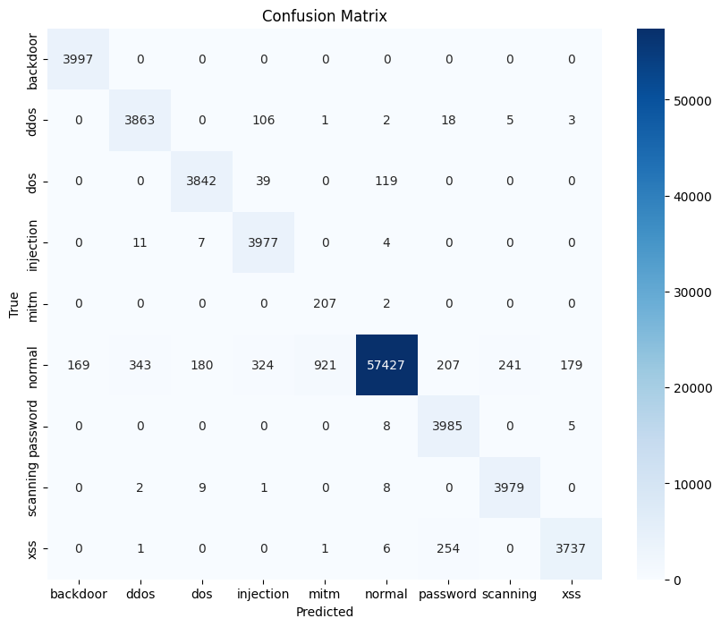
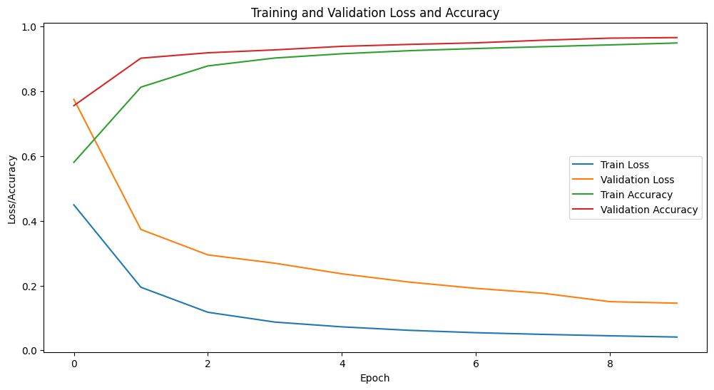
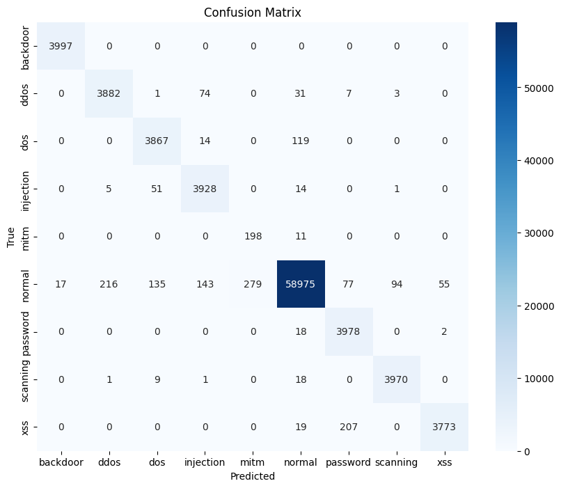
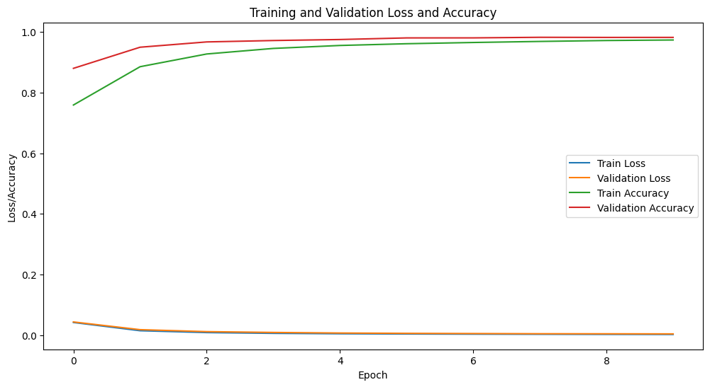

# Research 

## Test 1 - ids_1.ipynb
* Data Import
* Label Encoding
* Data Split Training and Testing
* Sequence Generation
* Data Sampling for Minoritu class MITM = 10k using ADYSN   

```
Final training shapes:
X_train_seq_final shape: (289522, 20, 44)
y_train_seq_final shape: (289522, 9)
X_val_seq shape: (72380, 20, 44)
y_val_seq shape: (72380, 9)
Final training label distributions:
y_train_seq_final distribution: Counter({np.int64(5): 192140, np.int64(3): 12871, np.int64(7): 12853, np.int64(2): 12846, np.int64(8): 12748, np.int64(6): 12738, np.int64(1): 12701, np.int64(0): 12680, np.int64(4): 7945})
y_val_seq distribution: Counter({np.int64(5): 47848, np.int64(0): 3319, np.int64(1): 3299, np.int64(6): 3261, np.int64(8): 3251, np.int64(2): 3154, np.int64(7): 3144, np.int64(3): 3129, np.int64(4): 1975})
```

* EarlyStopping(monitor='val_loss',patience=3,mode='min',restore_best_weights=True,verbose=1)
* ReduceLROnPlateau(monitor='val_loss',factor=0.5,patience=2,min_lr=1e-6,verbose=1)
* class_weights by median
```
frequencies = np.sum(y_train_seq_final, axis=0)
median_freq = np.median(frequencies)
class_weights = {cls: median_freq / count for cls, count in enumerate(frequencies)}
```

* Model Summary
```
┏━━━━━━━━━━━━━━━━━━━━━━━━━━━━━━━━━┳━━━━━━━━━━━━━━━━━━━━━━━━┳━━━━━━━━━━━━━━━┓
┃ Layer (type)                    ┃ Output Shape           ┃       Param # ┃
┡━━━━━━━━━━━━━━━━━━━━━━━━━━━━━━━━━╇━━━━━━━━━━━━━━━━━━━━━━━━╇━━━━━━━━━━━━━━━┩
│ bidirectional (Bidirectional)   │ (None, 20, 256)        │       177,152 │
├─────────────────────────────────┼────────────────────────┼───────────────┤
│ layer_normalization             │ (None, 20, 256)        │           512 │
│ (LayerNormalization)            │                        │               │
├─────────────────────────────────┼────────────────────────┼───────────────┤
│ dropout (Dropout)               │ (None, 20, 256)        │             0 │
├─────────────────────────────────┼────────────────────────┼───────────────┤
│ bidirectional_1 (Bidirectional) │ (None, 128)            │       164,352 │
├─────────────────────────────────┼────────────────────────┼───────────────┤
│ layer_normalization_1           │ (None, 128)            │           256 │
│ (LayerNormalization)            │                        │               │
├─────────────────────────────────┼────────────────────────┼───────────────┤
│ dropout_1 (Dropout)             │ (None, 128)            │             0 │
├─────────────────────────────────┼────────────────────────┼───────────────┤
│ dense (Dense)                   │ (None, 64)             │         8,256 │
├─────────────────────────────────┼────────────────────────┼───────────────┤
│ dense_1 (Dense)                 │ (None, 9)              │           585 │
└─────────────────────────────────┴────────────────────────┴───────────────┘
Total params: 351,113 (1.34 MB)
Trainable params: 351113 (1.34 MB)
Non-Trainable params: 0 (0.00 B)

precision    recall  f1-score   support

           0       0.96      1.00      0.98      3997
           1       0.92      0.97      0.94      3998
           2       0.95      0.96      0.96      4000
           3       0.89      0.99      0.94      3999
           4       0.18      0.99      0.31       209
           5       1.00      0.96      0.98     59991
           6       0.89      1.00      0.94      3998
           7       0.94      0.99      0.97      3999
           8       0.95      0.93      0.94      3999

    accuracy                           0.96     88190
   macro avg       0.85      0.98      0.88     88190
weighted avg       0.97      0.96      0.97     88190


   Class      FNR      FPR
 backdoor 0.000000 0.002007
     ddos 0.033767 0.004240
      dos 0.039500 0.002328
injection 0.005501 0.005583
     mitm 0.009569 0.010491
   normal 0.042740 0.005284
 password 0.003252 0.005689
 scanning 0.005001 0.002922
      xss 0.065516 0.002221
```







## Test 2 - ids_2.ipynb [same as part 1]

* instead of categorical_crossentropy, focal_loss method is used, epoch is 16
```
precision    recall  f1-score   support

           0       1.00      1.00      1.00      3997
           1       0.95      0.97      0.96      3998
           2       0.95      0.97      0.96      4000
           3       0.94      0.98      0.96      3999
           4       0.42      0.95      0.58       209
           5       1.00      0.98      0.99     59991
           6       0.93      0.99      0.96      3998
           7       0.98      0.99      0.98      3999
           8       0.99      0.94      0.96      3999

    accuracy                           0.98     88190
   macro avg       0.90      0.98      0.93     88190
weighted avg       0.98      0.98      0.98     88190

  Class      FNR      FPR
 backdoor 0.000000 0.000202
     ddos 0.029015 0.002637
      dos 0.033250 0.002328
injection 0.017754 0.002756
     mitm 0.052632 0.003171
   normal 0.016936 0.008156
 password 0.005003 0.003456
 scanning 0.007252 0.001164
      xss 0.056514 0.000677

```




## Test 3 - ids_3.ipynb [same as part 1]

* batch size is 32 and shuffle=True instead of False

```
precision    recall  f1-score   support

           0       0.99      1.00      1.00      3997
           1       0.98      0.96      0.97      3998
           2       0.98      0.96      0.97      4000
           3       0.96      0.99      0.97      3999
           4       0.39      0.96      0.55       209
           5       0.99      0.99      0.99     59991
           6       0.97      0.96      0.97      3998
           7       0.98      0.99      0.99      3999
           8       0.95      0.99      0.97      3999

    accuracy                           0.98     88190
   macro avg       0.91      0.98      0.93     88190
weighted avg       0.99      0.98      0.99     88190

 Class      FNR      FPR
 backdoor 0.000000 0.000273
     ddos 0.035018 0.001021
      dos 0.044250 0.000962
injection 0.011003 0.001924
     mitm 0.038278 0.003580
   normal 0.013202 0.011171
 password 0.037019 0.001425
 scanning 0.007252 0.001045
      xss 0.012003 0.002328
```


## Test 4 - ids_4.ipynb [same as part 2]

* shuffle=True, batch_size=32, smote class 4: 5000 only instead of 10k

```
precision    recall  f1-score   support

           0       1.00      1.00      1.00      3997
           1       0.97      0.97      0.97      3998
           2       0.96      0.97      0.96      4000
           3       0.96      0.98      0.97      3999
           4       0.40      0.96      0.56       209
           5       1.00      0.99      0.99     59991
           6       0.97      0.99      0.98      3998
           7       0.98      0.99      0.99      3999
           8       0.98      0.99      0.99      3999

    accuracy                           0.99     88190
   macro avg       0.91      0.98      0.93     88190
weighted avg       0.99      0.99      0.99     88190

 Class      FNR      FPR
 backdoor 0.000000 0.000119
     ddos 0.028514 0.001615
      dos 0.033500 0.001912
injection 0.016754 0.002067
     mitm 0.043062 0.003455
   normal 0.014202 0.007908
 password 0.006253 0.001378
 scanning 0.006752 0.001045
      xss 0.013003 0.000808
```